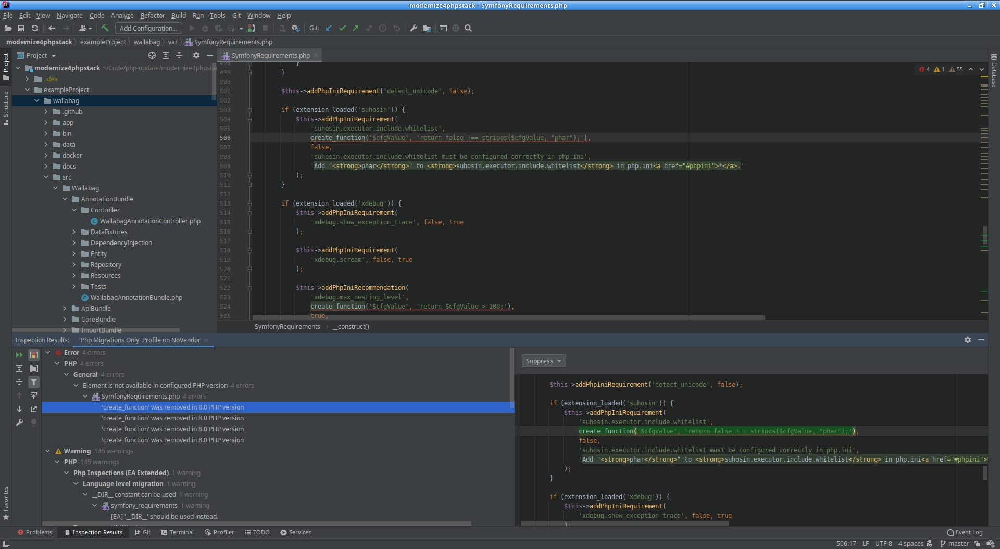

<h2>Zweck des Tools (Was verspricht es?):</h2>
<ul>
  <li>Statische Codeanalyse</li>
</ul>
<h2>Relevante Links (Gitrepo, Website, Docs):</h2>
<ul>
  <li>
    <a href="https://plugins.jetbrains.com/plugin/7622-php-inspections-ea-extended-">https://plugins.jetbrains.com/plugin/7622-php-inspections-ea-extended-</a>
  </li>
  <li>
     <a class="DbQRg" href="https://github.com/kalessil/phpinspectionsea">https://github.com/kalessil/phpinspectionsea</a> 
  </li>
</ul>
<h2>Angewendet auf:</h2>
<ul>
  <li>
    Wallabag 2.0.0-beta.1 (PHP-Version 5.6) (<a href="https://github.com/wallabag/wallabag/tree/94314e14eeeef7c43365a9fddbece04aec7173e3">https://github.com/wallabag/wallabag/tree/94314e14eeeef7c43365a9fddbece04aec7173e3</a>)
  </li>
</ul>
<h2>Was wurde getestet:</h2>
<ul>
  <li>
    Alle Inspections, die nach "deprecated" oder "migrations" o.ä. klangen, sowohl aus EA Extended, als auch aus IntelliJ selbst 
    
  </li>
  <li>
    Dafür wurde ein Inspections-Profil angelegt: <a href="Php Migrations Only.xml">Php Migrations Only.xml</a> 
  </li>
</ul>
<h2>Erfahrungen:</h2>
<ul>
  <li>Gut dokumentiert</li>
  <li>Detaillierter, strukturierter Output</li>
  <li>Um festzulegen, welche Dateien analysiert werden (z.B. /vendor/ ausschließen), muss man einen neuen Scope unter <em>Appearance and Behavior → Scopes  </em>anlegen</li>
  <li>Für die Übersichtlichkeit hilft es, die meisten anderen Inspections zu deaktivieren (siehe Profil oben)</li>
</ul>
<h2>Bewertung:</h2>
<ul>
  <li>Detaillierter und nachvollziehbarer Output</li>
  <li>Integriert sich gut in Intellij</li>
  <li>Intellij-bedingt, etwas umständlich zu konfigurieren (UX-Probleme, unintuitive Konfiguration)</li>
</ul>

   

<h2>Rating:</h2>
<h3>
  <strong> ★★★★
  </strong>☆ <strong>"Amazonsterne" 
  </strong>
</h3>
<ul>
  <li>
    <strong>Intellij hat einige eigenartige UX-Konzepte, die die Konfiguration erschweren, ermöglicht aber in absehbarer Zeit produktiv arbeiten zu können.</strong>
  </li>
</ul>
<h2>Beispieloutput</h2>
<h3>Wallabag:</h3>

